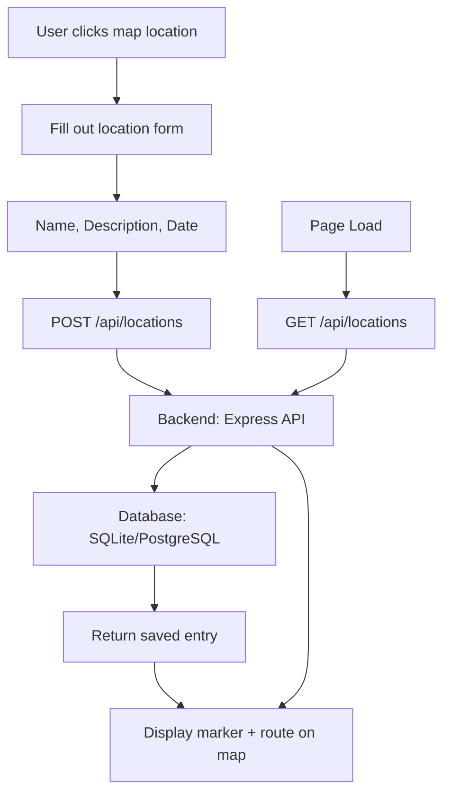

# Travel Blog

Create a visual travel journal by marking memorable locations on a map with stories and dates.

## Architecture

## Current Status

**Implemented:**
- Interactive Leaflet map centered on Cantupa, Philippines
- Click-to-place markers with automatic route connections
- Mobile-responsive design

**TODO:**
- Location entry form (name, description, date visited)
- Backend API for data persistence
- Edit/delete travel entries
- Display entries as blog posts

## Data Flow

1. User clicks map → Opens location entry form
2. User fills form (name, story, date) → POST to backend
3. Backend saves travel entry → Returns confirmation
4. Frontend adds marker to map → Connects to previous locations chronologically
5. Page reload → Fetches all entries and rebuilds map + blog posts

## Tech Stack

**Frontend:**
- HTML, CSS, JavaScript
- Leaflet.js for interactive mapping

**Backend (Planned):**
- Node.js + Express
- SQLite or PostgreSQL